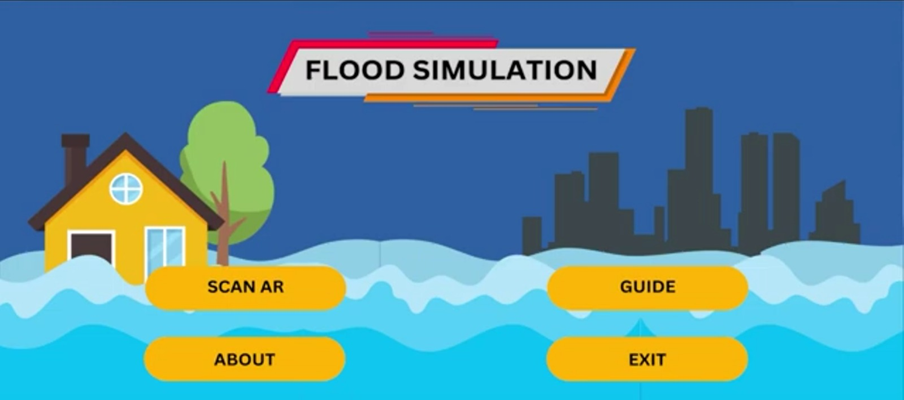
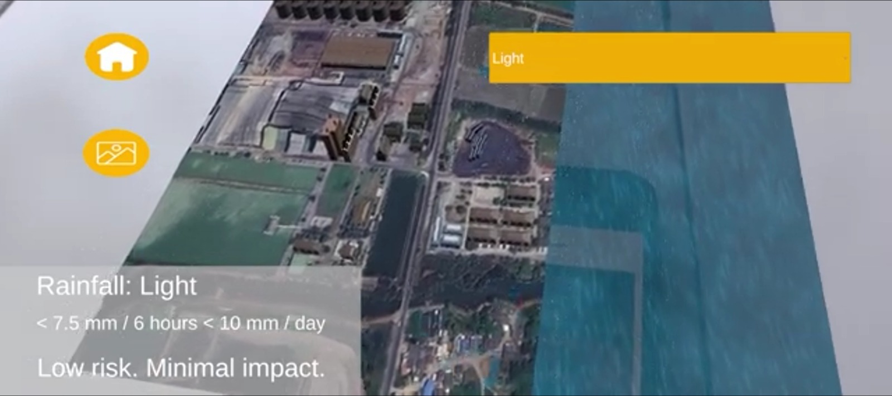

# AR Flood Simulation: Nakhon Phanom Case Study

**AR Flood Simulation** is an Android-based Augmented Reality application designed to visualize flood risks based on rainfall intensity. The simulation focuses on a factory area in **Nakhon Phanom, Thailand**, providing a real-time, interactive 3D visualization of water levels rising and spreading across the terrain.

This project was developed as a "Proyek Independen Mahasiswa" (Student Independent Project) at **Universitas Pendidikan Ganesha**, in collaboration with **King Mongkut's University of Technology Thonburi (KMUTT)**, Thailand.

## 📖 Table of Contents
- [About the Project](#-about-the-project)
- [Features](#-features)
- [Tech Stack](#-tech-stack)
- [Rainfall Categories](#-rainfall-categories)
- [Installation & Usage](#-installation--usage)
- [Screenshots](#-screenshots)
- [Team](#-team)

## ℹ️ About the Project
Flooding is a complex challenge in urban areas, often caused by high rainfall exceeding drainage capacity. Static flood maps are often difficult for the general public to interpret.

This application aims to:
1. Visualize flood potential interactively using AR.
2. Provide concrete educational media regarding the impact of rainfall on the environment.
3. Support disaster mitigation awareness.

The app simulates the overflow of the Mekong river and drainage systems around a specific factory site in Nakhon Phanom based on user-selected rainfall data.

## 🌟 Features
* **Marker-Based Tracking:** Uses Vuforia to detect a specific map marker of the factory area.
* **Interactive UI:** Clean interface with 'Scan AR', 'Guide', and 'About' menus.
* **Rainfall Simulation Selector:** Users can choose between 4 intensity levels:
    * Light
    * Medium
    * Heavy
    * Very Heavy
* **Real-time 3D Animation:** Visualizes rain effects and rising water levels (puddles to severe flooding) overlaid on the physical map.

## 🛠 Tech Stack
* **Engine:** Unity
* **AR SDK:** Vuforia Qualcomm (Target Management System)
* **3D Modeling:** Blender (for environment and water animation)
* **Debugging:** RenderDoc (for graphics debugging)
* **Development Method:** MDLC (Multimedia Development Life Cycle)

## 🌧 Rainfall Categories
The simulation logic is based on the following rainfall data:

| Category | Intensity (mm/6 hours) | Intensity (mm/day) | Risk Level |
| :--- | :--- | :--- | :--- |
| **Light** | < 7.5 | < 10 | Low risk, minimal impact |
| **Medium** | 7.5 - 35 | 10 - 50 | Potential puddles in low areas |
| **Heavy** | 35 - 70 | 50 - 100 | Urban flooding likely |
| **Very Heavy** | > 70 | > 100 | Severe flood risk, evacuation needed |

## 📲 Installation & Usage
### Prerequisites
* Android Device with **Android 10 (API Level 29)** or higher.
* Minimum RAM: **4GB**.
* Rear Camera functioning.

### Steps
1.  Download the `.apk` file from the [Releases Section](#).
2.  Install the application on your Android device.
3.  **Print or Display the Marker:** You need the specific satellite map image of the Nakhon Pathom factory.
4.  Open the App and tap **"Scan AR"**.
5.  Point your camera at the marker until the 3D terrain appears.
6.  Select a rainfall button to see the flood simulation.

> **Demo Video:** Watch the application in action [here](https://youtu.be/qeHYk8OmlG8).

## 📸 Screenshots

 

*(Note: Ensure you have an 'images' folder in your repo with screenshots named 'menu-ui.png' and 'flood-simulation.png')*

## 👥 Team
**Universitas Pendidikan Ganesha (Software Engineering Technology)**
* **I Gede Dhananjaya** (Developer: Unity Implementation, MDLC Logic)
* **Luh Ayu Febriasih** (Assets: 3D Modeling, Data Collection)

**Supervisors**
* Dr. Ni Wayan Marti, S.Kom., M.Kom.
* Dr. Ni Ketut Kertiasih, S.Si., M.Pd.

---
*This project is part of the Student Independent Project (PIM) 2025.*
